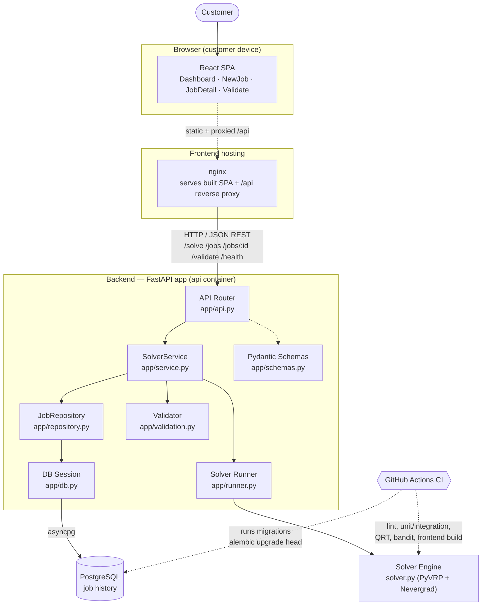
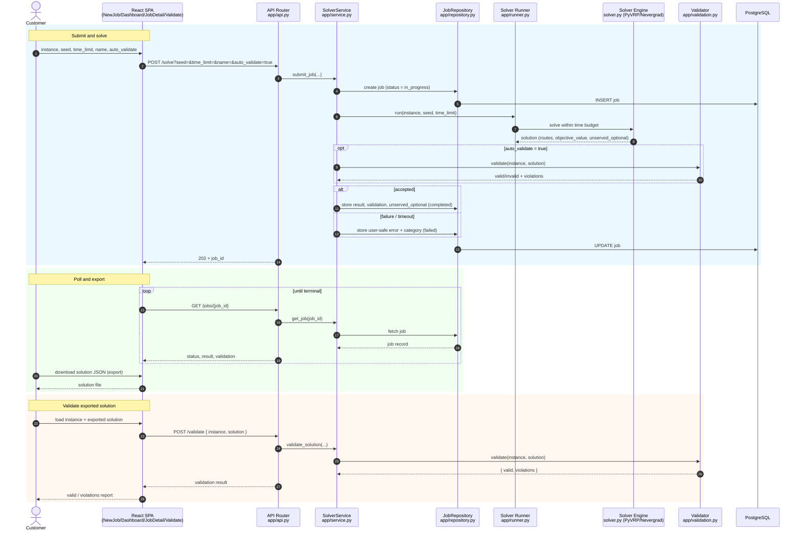
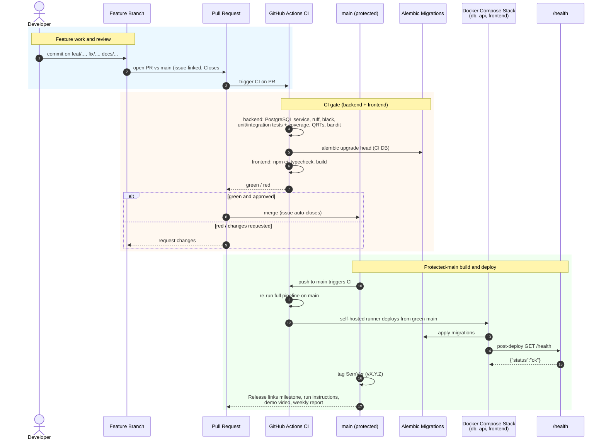
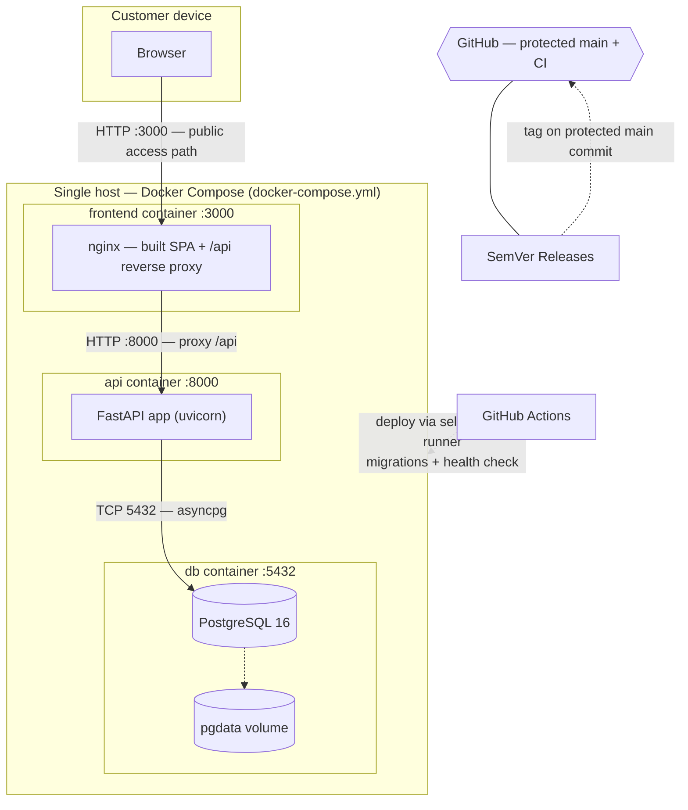

# Architecture Documentation

This is the maintained architecture artifact for the Route Optimization Platform. It documents `MVP v2` through three architectural views — **static**, **dynamic**, and **deployment** — and links the Architecture Decision Records (ADRs) that explain why the system is shaped this way.

The authoritative diagrams-as-code sources are Mermaid `.mmd` files stored next to this document (see each view section). Mermaid is also used for the git workflow diagram in `docs/development-process.md`, keeping a single diagram toolchain across the maintained documentation.

## Contents

- [Static View](#static-view) — component diagram
- [Dynamic View](#dynamic-view) — sequence diagrams for the solve/export/validate workflow and the deployment workflow
- [Deployment View](#deployment-view) — runtime/deployment structure
- [Architecture Decisions](#architecture-decisions) — ADRs and how they fit together

---

## Static View

The static view shows what the system is made of: the main internal components, the external systems and actors they interact with, and the communication paths between them.

**Source:** [`static-view/component.mmd`](static-view/component.mmd)

### What the diagram shows

- **Frontend layer:** a React single-page application (Dashboard, NewJob, JobDetail, Validate screens) served as static assets by nginx, which also reverse-proxies `/api` to the backend.
- **Backend FastAPI app:** the API router (`app/api.py`) exposes the REST endpoints; `SolverService` (`app/service.py`) is the orchestration boundary — it persists jobs through `JobRepository`, runs solving through the Solver Runner, and validates results through the Validator. Request/response shapes are defined in `app/schemas.py`.
- **Solver engine:** `solver.py` (PyVRP + Nevergrad) performs the actual CVRPTW optimization and is reached only through the runner.
- **Datastore:** PostgreSQL holds job history and is accessed asynchronously via SQLAlchemy/asyncpg (`app/db.py`, `app/repository.py`).
- **CI:** GitHub Actions validates every change (lint, tests, QRTs, security scan, frontend build) and applies Alembic migrations against a CI database.

### Coupling, cohesion, and maintainability

- **Clear orchestration boundary.** All cross-cutting work funnels through `SolverService`: persistence goes through `JobRepository`, execution through the Solver Runner, validation through the Validator. This keeps the API router thin and makes the service layer the single place to reason about the job lifecycle.
- **High cohesion within modules.** Each backend module has one responsibility (routing, orchestration, persistence, solving, validation, serialization, DB session). This makes changes localized and reviewable.
- **Loose coupling to the solver.** The solver engine is reached only through the runner, so the optimization library (PyVRP/Nevergrad) can be re-tuned or replaced without touching the API or persistence layers. This is directly relevant to Sprint 5 solver-investigation work.
- **Maintainability implications.** A new endpoint only touches the router + service + schemas. A new persistence field only touches the repository, the schema, and an Alembic revision. A solver change only touches the runner/engine and its tests.

### Quality requirements particularly supported

- **QR-FC-01 (Functional correctness):** the Validator sits on the success path, so a result is only accepted when it passes validation. See [ADR-0002](adr/0002-pyvrp-nevergrad-bounded-runner.md).
- **QR-RE-01 (Recoverability):** jobs flow only through `JobRepository` into PostgreSQL, so no job is lost on restart. See [ADR-0001](adr/0001-fastapi-async-sqlalchemy-postgresql.md).
- **QR-SE-01 (Confidentiality):** the service/runner boundary is where raw failures are converted into user-safe messages. See [ADR-0003](adr/0003-user-safe-error-handling.md).
- **QR-PE-01 (Time behaviour):** the bounded runner enforces the time budget. See [ADR-0002](adr/0002-pyvrp-nevergrad-bounded-runner.md).

---

## Dynamic View

The dynamic view shows how the components collaborate over time for non-trivial workflows. Two flows are documented: the primary **solve/export/validate** product flow, and the **build and deployment** workflow.

### Flow 1 — Solve, export, and validate

**Source:** [`dynamic-view/solve-export-validate.mmd`](dynamic-view/solve-export-validate.mmd)

**What the scenario represents and why it matters.** This is the end-to-end customer journey: submit an optimization job, watch it progress, export the produced solution, and independently validate the exported file. It is the most important flow because it is how the customer gets value from the product and how correctness is demonstrated. It also exercises every backend component (router, service, repository, runner, solver, validator) and the database.

**Decisions and boundaries it helps reason about.** The flow shows the async, poll-based job lifecycle (so the API stays responsive while solving), the validation gate on the success path (QR-FC-01), the bounded runner that drives jobs to a terminal state (QR-PE-01), persistent status transitions through the repository (QR-RE-01), and the conversion of failures into user-safe errors (QR-SE-01). It also shows that the exported solution feeds directly into `/validate`, which is the basis for the Sprint 5 "Export validator-compatible solution JSON" work (issue #126).

### Flow 2 — Protected-main build and deployment workflow

**Source:** [`dynamic-view/deployment-workflow.mmd`](dynamic-view/deployment-workflow.mmd)

**What the scenario represents and why it matters.** This is the path a change takes from a feature branch to a customer-accessible deployment: an issue-linked PR, the CI gate (with migrations applied against a real PostgreSQL service), the protected-main merge, the automatic deployment from green `main` via the self-hosted runner, the post-deploy health check, and the SemVer release. It documents how quality and recoverability evidence is produced continuously, not just at submission time.

**Boundaries it helps reason about.** The diagram makes the protected-default-branch and CI-gate boundaries explicit, and shows where the self-hosted runner auto-deploy (see [`docs/deployment.md`](../deployment.md)) plugs in. It connects the workflow documented in `docs/development-process.md` to the runtime deployment shown in the deployment view.

---

## Deployment View

The deployment view shows the runtime/deployment structure: the deployed services, the datastore, the customer-facing access path, and the network boundary.

**Source:** [`deployment-view/deployment.mmd`](deployment-view/deployment.mmd)

### Why this deployment model was chosen

- **Reproducibility for customers and graders.** A single `docker compose up --build` brings up the database, the API, and the frontend in a known-good configuration. This matches the requirement that the customer must be able to run the system directly. See [ADR-0004](adr/0004-docker-compose-deployment.md).
- **Lifecycle separation.** The frontend (static assets), the Python backend, and the stateful database have different build chains and lifecycles; one container per concern keeps them independently buildable and restartable.
- **Persistence by default.** The `pgdata` named volume keeps job history across container recreation, which is what makes QR-RE-01 verifiable in the deployed system.

### How the current deployment supports or constrains the product

- **Supports:** all four quality requirements are observable in this deployment — correctness and time behaviour through the running solver, recoverability through the persistent volume, and confidentiality through the API responses customers actually receive.
- **Constrains:** the Compose model targets a single host, so horizontal scaling, load balancing, and managed databases are out of scope for this increment. Large-instance solver runs are bounded by the host's resources; this is reflected in the QR-PE-01 scope.

### What must be considered when deploying or operating it

- Run `alembic upgrade head` (handled on backend startup and in CI) before serving traffic.
- Keep `DATABASE_URL`, `CORS_ORIGINS`, and any production secrets in the deployment environment or GitHub Secrets — never in the committed Compose files (see [ADR-0003](adr/0003-user-safe-error-handling.md) and `docs/development-process.md`).
- Use the `/health` endpoint as the post-deploy and container health check.
- The customer-facing access path is `frontend :3000`; only that port (and optionally `api :8000`) needs to be exposed outside the Compose network.

---

## Architecture decisions

The recorded decisions live in [`adr/`](adr/). Together they explain the shape documented above:

| Decision | What it shapes | View |
|---|---|---|
| [ADR-0001 — FastAPI + async SQLAlchemy + PostgreSQL](adr/0001-fastapi-async-sqlalchemy-postgresql.md) | The persistence tier and why job history survives restarts (QR-RE-01). | Static, Deployment |
| [ADR-0002 — PyVRP + Nevergrad bounded runner](adr/0002-pyvrp-nevergrad-bounded-runner.md) | The solver pipeline and its correctness/time guarantees (QR-FC-01, QR-PE-01). | Static, Dynamic |
| [ADR-0003 — User-safe error handling](adr/0003-user-safe-error-handling.md) | Where raw failures become safe messages (QR-SE-01). | Dynamic |
| [ADR-0004 — Docker Compose deployment](adr/0004-docker-compose-deployment.md) | The three-service deployment model. | Deployment |

### How the architecture and the decisions fit together

The **static** view is the direct consequence of ADR-0001 and ADR-0002: the layered FastAPI app with a single orchestration boundary (`SolverService`), a dedicated persistence boundary (`JobRepository` → PostgreSQL), and an isolated solver engine reached only through the runner. The **dynamic** view shows those boundaries in motion — the runner enforces the time budget and terminal states (ADR-0002), the service converts failures into safe messages (ADR-0003), and the repository guarantees persistence (ADR-0001). The **deployment** view packages exactly those components into the three-service Compose stack (ADR-0004) with a persistent volume so that recoverability holds in the running system. Each quality requirement in [`docs/quality-requirements.md`](../quality-requirements.md) links back to the ADR that realizes it.

The full ADR index, status lifecycle, and naming rules are in [`adr/README.md`](adr/README.md).
