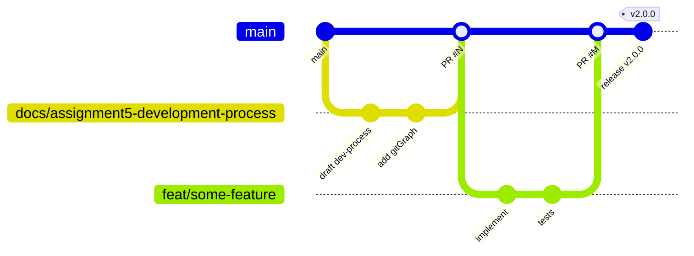

# Development Process and Configuration Management

This is the maintained artifact for the team's development workflow and configuration-management rules. It is the canonical reference for how work is branched, reviewed, tested, released, and configured for `MVP v2` and later increments.

It is linked from the root [`README.md`](../README.md), the hosted documentation site, and the Week 5 public report.

## Scope and audience

This document is written for all team members and for graders who need to understand how the repository is developed and configured. It covers:

- the Git branching and merge workflow;
- issue-linked and traceable development;
- the review and acceptance process;
- the CI pipeline that gates merges;
- the release and SemVer workflow;
- configuration management: environment variables, Docker, dependencies, database migrations, and secret handling;
- the maintained evidence and traceability locations.

Private credentials, private customer data, and private access details are never documented here. See the [Secret and sensitive information handling](#secret-and-sensitive-information-handling) section.

---

## Git workflow

The team uses a trunk-based GitHub flow. `main` is the protected default branch and always reflects a deployable state. All work happens on short-lived feature branches and lands on `main` only through a reviewed pull request.

### Branching model

### What the diagram shows and how we use it

The diagram shows the supported branch lifecycle:

- `main` advances only through merges (the trunk). Every node on `main` is a reviewed, CI-checked commit.
- A feature or documentation branch (`docs/...`, `feat/...`, `fix/...`) is created from the latest `main`.
- Work is committed on the branch in small, reviewable increments.
- The branch lands on `main` via a pull request merge (`PR #N`, `PR #M`). **Merge commits** are used (squash and rebase merging are disabled) so the merge, the reviewed branch, and the `Closes #N` link remain visible on `main`.
- Release tags (`v2.0.0`) are applied to a commit on `main` after the increment is verified.

In practice, the team uses the branch prefixes shown across the repository history:

- `feat/...` for product features and architecture work;
- `fix/...` for bug fixes;
- `docs/...` for documentation, planning, and report artifacts.

Long-lived feature branches are avoided. When a large change is split across many sub-branches (as in Assignment 4's numbered `30-...` through `44-...` branches), they are merged into an integration branch and then brought to `main` as a single reviewed PR.

---

## Issue-linked workflow

All work is traced to a GitHub issue. The flow is:

1. **Create or refine an issue.** Every Product Backlog Item (PBI) and bug has an issue with `Type`, `Expected outcome`, `Acceptance criteria`, `Story Points`, `Priority`, `MVP version`, `Implementer`, a different `Reviewer`, and `Work Status`. Issues are labelled with the assignment sprint (for example `assignment-5`) and MoSCoW priority (for example `priority: must-have`).
2. **Branch from `main`.** Name the branch `<issue-number>-short-description` (for example `42-add-login-form`). Descriptive type prefixes such as `feat/...`, `fix/...`, or `docs/...` may be used together with the issue number (for example `docs/161-polish-readme`).
3. **Implement and commit.** Commits reference the issue where useful (`refs #N` or `closes #N` in the PR body).
4. **Open a pull request.** The PR uses [`.github/pull_request_template.md`](../.github/pull_request_template.md): a Summary of changes, a `Closes #N` line, Testing performed, acceptance-criteria verification, and the reviewer checklist.
5. **Review by a different team member.** The reviewer must not be the implementer recorded on the issue.
6. **Merge after CI is green and acceptance criteria are verified.** The PR body contains `Closes #N` so the issue closes automatically on merge.

### Work Status labels

Issues carry a Work Status label (matching the issue-form dropdown) so the board reflects reality:

- `To Do` — in the Product Backlog, not yet ready to start.
- `Ready` — selected for the current Sprint, assigned, estimated, has the required description and acceptance criteria, and can be started without major unanswered questions.
- `In Progress` — work has started on the PBI.
- `In Review` — the implementation is ready for review and the issue-linked pull request is open or the review is actively happening.
- `Done` — acceptance criteria and this Definition of Done are satisfied, the issue-linked PR is merged into protected `main`, and the PBI is complete for the Sprint.

A PBI moves to `Ready` only when it has an implementer, a different reviewer, an estimate, and acceptance criteria; it moves to `In Review` only when the pull request is open and CI is green.

### Milestones and the board

- A **milestone** per Sprint (for example `Sprint 4 — Week 6 Trial Release and Transition Readiness`) is the authoritative Sprint container. Issues assigned to the milestone form the Sprint Backlog.
- The **GitHub Project board** (<https://github.com/orgs/Team-9-swp/projects/1>) provides the Product Backlog and Sprint Backlog views with fields for Status, Story Points, MVP Version, MoSCoW priority, and Assignee.

---

## Review and acceptance process

A PR is mergeable only when all of the following hold:

- **Different reviewer.** The reviewer is the team member recorded as `Reviewer` on the linked issue, never the implementer.
- **Acceptance criteria verified.** The PR body checks off the issue's acceptance criteria, with evidence (test names, screenshots, or links) where relevant.
- **CI is green.** The pipeline described below must pass on the PR.
- **Documentation updated.** If the change affects setup, usage, deployment, architecture, quality requirements, or the Definition of Done, the corresponding `docs/` files are updated in the same PR.
- **CHANGELOG updated** for user-visible changes.

Reviewers use the PR template checklist: code reviewed, tests reviewed, documentation updated, CHANGELOG updated.

---

## CI pipeline

Continuous Integration is defined in [`.github/workflows/ci.yml`](../.github/workflows/ci.yml) and runs on every pull request and every push to `main`.

The pipeline has two jobs:

### Backend job

- Spins up a **PostgreSQL 16** service container.
- Installs Python 3.11 dependencies from `requirements.txt` plus `ruff`, `black`, `pytest-cov`, `bandit`, `httpx`.
- Runs **Alembic migrations** (`alembic upgrade head`) against the live database.
- **Lints** with `ruff check . --output-format=github`.
- **Formats** with `black --check .`.
- Runs **unit and integration tests** with coverage (`pytest tests/ --ignore=tests/quality --ignore=tests/test_e2e.py -m "not slow" --cov=app`).
- Runs **Quality Requirement Tests** (`pytest tests/quality/ -m "qrt"`).
- Runs **Bandit** security static analysis on `app/`.
- Uploads coverage and JUnit XML artifacts.

### Frontend job

- Sets up Node.js 20 with npm caching.
- `npm ci` install.
- `npm run typecheck` (TypeScript type checking).
- `npm run build` (Vite production build).

A green CI run on `main` is the signal that the increment is deployable. CI status, latest protected-default-branch run, and the SemVer release are linked from each weekly public report.

## Deployment

After the `backend` and `frontend` jobs pass on `main`, a `deploy` job runs on a **self-hosted GitHub Actions runner that lives on the deployment VM** (`runs-on: self-hosted`). It is the only job that uses the self-hosted runner, and it runs only on a push to `main` (or a manual `workflow_dispatch`), so code from pull requests is never executed on the VM.

The `deploy` job checks out the deployed commit, rebuilds the Compose stack, applies Alembic migrations, and runs a local `/health` check. Because the VM sits behind the campus network with no public IP, the runner reaches GitHub over outbound HTTPS, so no inbound port, tunnel, or host SSH credential in GitHub is required.

The full pipeline, runner setup, manual redeploy, rollback, and recovery procedures are documented in [`docs/deployment.md`](deployment.md).

---

## Release and SemVer workflow

Releases follow [Semantic Versioning](https://semver.org/spec/v2.0.0.html) and are documented in [`CHANGELOG.md`](../CHANGELOG.md) using the [Keep a Changelog](https://keepachangelog.com/en/1.1.0/) format.

The release process:

1. Ensure `main` is green and contains the increment to ship.
2. Update `CHANGELOG.md` under a new `## [x.y.z] - YYYY-MM-DD` section with Added / Changed / Removed / Fixed entries.
3. Update the application version (for example `app/main.py`'s `version="..."`) when the API version changes.
4. Create a **GitHub Release** with a SemVer tag prefixed with `v` (for example `v1.2.0`) pointing at a commit on `main`.
5. The release notes link the Sprint milestone, run/access instructions, the public sanitized demo video, and the relevant weekly public report.

Past releases: `v1.0.0` (MVP v1), `v1.1.0` and `v1.2.0` (Assignment 4 increments). `MVP v2` maps to the next SemVer release produced from the Sprint 5 increment.

The Sprint milestone is kept separate from the SemVer release: the milestone is the Sprint container, the SemVer tag is the shipped increment mapped to an MVP version.

---

## Configuration management

This section documents how the product is configured across environments. The goal is that any team member or grader can reproduce the running system from the committed sources plus a small, non-secret set of environment values.

### Environment variables

All runtime configuration is delivered through environment variables. The committed template is [`.env.example`](../.env.example):

| Variable | Purpose | Example |
|---|---|---|
| `DATABASE_URL` | Async SQLAlchemy database URL for PostgreSQL. | `postgresql+asyncpg://optimizer:optimizer@db:5432/optimizer` |
| `CORS_ORIGINS` | Comma-separated list of allowed CORS origins for the API. | `http://localhost:3000,http://localhost:5173` |
| `LOG_LEVEL` | Backend log verbosity. | `info` |
| `VITE_API_BASE_URL` | Base URL the frontend bundles as the API target at build time. | `http://localhost:8000` |

`DATABASE_URL` is the only variable not listed in `.env.example` because it is provided by the Compose file for local/CI use and by the deployment environment for production. Defaults are defined in code: CORS origins fall back to `http://localhost:5173,http://localhost:3000` (`app/main.py`).

### Docker configuration

The full stack is defined in [`docker-compose.yml`](../docker-compose.yml) with three services:

- **`db`** — `postgres:16-alpine` with a named volume `pgdata` for persistent storage and a `pg_isready` health check.
- **`api`** — built from `app/Dockerfile`, exposes `8000`, depends on a healthy `db`, and runs a `/health` health check.
- **`frontend`** — built from `frontend/Dockerfile` (React production build served by nginx), exposes `3000:80`, depends on `api`.

The production override [`docker-compose.prod.yml`](../docker-compose.prod.yml) adds `restart: unless-stopped`, a production `CORS_ORIGINS` that includes the public domain, and `LOG_LEVEL=warning`.

The frontend nginx config is committed at [`frontend/nginx.conf`](../frontend/nginx.conf); the Vite proxy (`/api` → `http://localhost:8000`) is configured in [`frontend/vite.config.ts`](../frontend/vite.config.ts) for local development.

### Dependencies

- **Backend:** Python 3.11, pinned in [`requirements.txt`](../requirements.txt). The CI installs the same file plus the dev/test tools (`ruff`, `black`, `pytest-cov`, `bandit`, `httpx`).
- **Frontend:** Node.js 20, dependencies locked in [`frontend/package-lock.json`](../frontend/package-lock.json); CI uses `npm ci` for reproducible installs.
- Dependency changes go through the same reviewed PR workflow and must keep CI green.

### Database migrations

Schema changes are managed with **Alembic** ([`alembic.ini`](../alembic.ini), [`alembic/`](../alembic/)):

- Migration scripts live in [`alembic/versions/`](../alembic/versions/) and are named with a date prefix (for example `20260628_create_jobs_table.py`).
- Migrations are applied automatically on backend startup (`init_db` in `app/db.py`) and explicitly in CI (`alembic upgrade head`) before tests.
- A schema change always ships with a new Alembic revision in the same PR; raw SQL edits to the running database are not permitted.

### Secret and sensitive information handling

- **No secrets in the repository.** Credentials, API keys, tokens, private customer data, private recording links, and private access details are never committed.
- Real production values (database passwords, deployment tokens, domain-specific secrets) are provided through the deployment environment or **GitHub Secrets** for CI/deployment workflows — never inline in Compose files or code.
- The values in `docker-compose.yml` (`optimizer:optimizer`) are local/CI defaults only; production overrides them through environment injection.
- See [`docs/quality-requirements.md`](quality-requirements.md) (`QR-SE-01`) for the requirement that API responses and stored error fields must not leak stack traces, internal paths, environment variables, or credentials.
- The `Repository_Requirements.md` (private course material, not committed) configuration baseline is the authoritative rule set for sensitive-information handling; this document is the project-specific reflection of it.

---

## Maintained evidence and traceability locations

| Artifact | Location | Purpose |
|---|---|---|
| Product Backlog and Sprint Backlog | GitHub Project board | Work management and Sprint scope. |
| Sprint container | GitHub milestone (e.g. `Sprint 4 — Week 6 Trial Release and Transition Readiness`) | Selected Sprint PBIs. |
| PBIs and bugs | GitHub Issues | Traceable work items with acceptance criteria. |
| CI pipeline | `.github/workflows/ci.yml` | Automated quality gate. |
| Quality requirements | [`docs/quality-requirements.md`](quality-requirements.md) | Measurable QR definitions. |
| Quality requirement tests | [`docs/quality-requirement-tests.md`](quality-requirement-tests.md) | Automated QRT specifications. |
| Testing strategy | [`docs/testing.md`](testing.md) | Test layers and coverage expectations. |
| Definition of Done | [`docs/definition-of-done.md`](definition-of-done.md) | Completion standard. |
| User acceptance tests | [`docs/user-acceptance-tests.md`](user-acceptance-tests.md) | Maintained UAT scenarios. |
| Roadmap | [`docs/roadmap.md`](roadmap.md) | Current direction and next increment. |
| Architecture | [`docs/architecture/README.md`](architecture/README.md) | Static, dynamic, and deployment views. |
| ADRs | [`docs/architecture/adr/`](architecture/adr/) | Architecture Decision Records. |
| Deployment | [`docs/deployment.md`](deployment.md) | Auto-deploy pipeline, runner setup, rollback. |
| Changelog | [`CHANGELOG.md`](../CHANGELOG.md) | User-visible change history. |
| Weekly reports | `reports/weekN/README.md` | Public report and submission index per week. |

---

## Change control for this document

This is a maintained artifact. When the workflow, CI, release process, configuration model, or secret-handling rules change, this file is updated in the same PR that introduces the change and is reviewed by a different team member.
