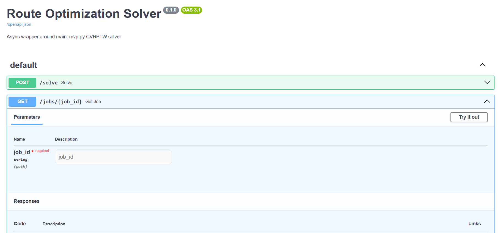
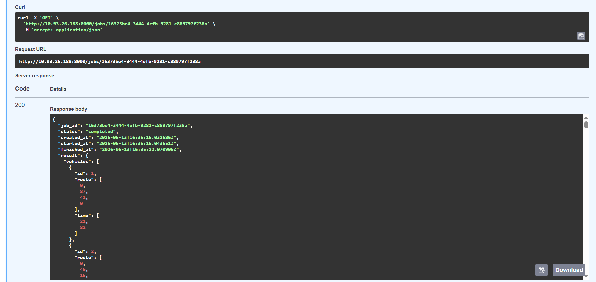

# Week 2 Report — Route Optimization Platform

## 1. Project Overview

**Route Optimization Platform** is a logistics optimization system that generates vehicle and loader routes while considering time windows, vehicle capacity, loader requirements, and other hard constraints.

1. [Project repository](https://github.com/Team-9-swp/Route-optimization-Platform-swp)
2. [MIT License](../../LICENSE)

## 2. User Stories

1. [Week 2 User Stories](./user-stories.md)

## 3. Selected Interface and Prototype

The selected interface for the current product version is a command-line interface that can be executed locally or through Docker.
TODOTODOTODOTODOTODOTODOTODOTODOTODOTODOTODOTODOTODO
1. [CLI Interface Documentation](../../docs/interface.md - TODO)
2. **CLI demonstration:** included in the MVP v0 video.
TODOTODOTODOTODOTODOTODOTODOTODOTODOTODOTODOTODOTODOTODOTODOTODO
3. **Runnable artifact:** TODO — add a GitHub Release, Docker image, package, or deployment link.

The interface allows users to:

1. provide an input JSON file;
2. specify an output JSON file;
3. configure the execution time limit;
4. configure the random seed;
5. run the solver;
6. receive generated vehicle and loader routes;
7. validate the generated solution.

## 4. MVP v0
TODOTODOTODOTODOTODOTODOTODOTODOTODOTODOTODOTODOTODOTODOTODO
1. [MVP v0 Report](./mvp-v0-report.md)
2. **Runnable artifact or deployment:** TODO — add link.
3. **Run instructions:** provided in the [MVP v0 Report](./mvp-v0-report.md).
4. **Public MVP v0 video:** TODO — add a public view-only link to a video shorter than two minutes.
TODOTODOTODOTODOTODOTODOTODOTODOTODOTODOTODOTODTODOTODOOTODO
MVP v0 provides the runnable technical foundation of the product. It reads a problem instance, generates vehicle and loader routes, improves the solution using heuristic methods, validates the result, and creates an output file.
TODOTODOTODOTODOTODOTODOTODOTODOTODOTODOTODOTODTODOTODOOTODO
## 5. Pull Request Workflow

1. [Pull Request Template](../../.github/pull_request_template.md)
2. [PR #1 — Week 2 report and documentation](https://github.com/Adelevere/Route-optimization-Platform/pull/1)
3. [PR #2 — Issue and Pull Request templates](https://github.com/Adelevere/Route-optimization-Platform/pull/2)
4. **Reviewed and approved PR:** TODO — add a link after another team member submits an `Approve` review.
5. **Merged PR:** TODO — update after the reviewed PR is merged into `main`.

The required review must be completed by another team member. A self-review does not count.

## 6. Lychee Link Checking

1. [Lychee Workflow Configuration](../../.github/workflows/lychee.yml)
2. **Latest successful run on the protected `main` branch:** TODO — add the GitHub Actions run link.

Lychee must check Markdown links:

1. when a Pull Request is created or updated;
2. when changes are pushed or merged into `main`.

## 7. Excluded Lychee Links

No links are currently excluded from Lychee checks.

If exclusions are added later, each excluded link must be listed here together with:

1. the reason for exclusion;
2. confirmation that it was manually opened in a browser;
3. the manual verification date.

**Manual verification date:** TODO — add date before submission.
TODOTODOTODOTODOTODOTODOTODOTODOTODOTODOTODOTODTODOTODOOTODO
## 8. Screenshots

All screenshots must be stored in `reports/week2/images/` in PNG format.

### 8.1 Protected Default Branch


### 8.2 Reviewed Pull Request


### 8.3 Selected CLI Interface



### 8.4 MVP v0 Runnable Artifact



## 9. Coverage

### 9.1 Interface Coverage

The selected CLI and Docker interface represents the following user stories:

1. [US-01: Vehicle Route and Schedule](./user-stories.md#us-01-vehicle-route-and-schedule)
   The generated output contains the route and visit schedule for each vehicle.

2. [US-02: Loader Route](./user-stories.md#us-02-loader-route)
   The generated output contains loader assignments and routes.

3. [US-03: Hard Constraint Validation](./user-stories.md#us-03-hard-constraint-validation)
   The solution can be checked using the validation script.

4. [US-04: Docker Execution](./user-stories.md#us-04-docker-execution)
   The solver can be executed in a reproducible Docker environment.

5. [US-05: Algorithm Time Limit](./user-stories.md#us-05-algorithm-time-limit)
   The CLI is intended to accept a configurable execution time limit.

6. [US-06: Reproducible Random Seed](./user-stories.md#us-06-reproducible-random-seed)
   The CLI is intended to accept a random seed for reproducible runs.

7. [US-07: Objective Function Value](./user-stories.md#us-07-objective-function-value)
   The result includes or allows calculation of the objective function value.

8. [US-08: Planned Routes Overview](./user-stories.md#us-08-planned-routes-overview)
   The output JSON provides all planned vehicle and loader routes.

The CLI commands, parameters, input and output formats, successful execution example, and error cases are documented in [docs/interface.md](../../docs/interface.md).

### 9.2 MVP v0 Coverage

The MVP v0 foundation is described in the [MVP v0 Report](./mvp-v0-report.md).

MVP v0 currently provides a foundation for:

1. [US-01: Vehicle Route and Schedule](./user-stories.md#us-01-vehicle-route-and-schedule)
2. [US-02: Loader Route](./user-stories.md#us-02-loader-route)
3. [US-03: Hard Constraint Validation](./user-stories.md#us-03-hard-constraint-validation)
4. [US-04: Docker Execution](./user-stories.md#us-04-docker-execution)

The MVP v0 report also contains a repeatable smoke-check scenario covering:

1. cloning the repository;
2. building the Docker image;
3. running the CLI help command;
4. running the solver on a sample input;
5. confirming that an output file is generated;
6. running the validator;
7. checking that no hard constraints are violated.

MVP v0 is a product foundation and does not need to fully implement every related user story.

## 10. Customer Meeting Transcript and Notes

1. [Customer Meeting Notes](./customer-meeting-notes.md)
2. **Sanitized English transcript:** publication permission is currently pending.

Until separate public publication permission is received, the transcript must not be published in the public repository.

If the customer permits private instructor sharing but refuses public publication, use the following statement:

> The sanitized English transcript is provided privately through Moodle with the customer's permission.

If public publication is permitted, add:

```markdown
[Sanitized Customer Meeting Transcript](./customer-meeting-transcript.md)
```

## 11. Customer Meeting Summary

1. [Customer Meeting Summary](./customer-meeting-summary.md)

The summary contains the main customer feedback, approved decisions, interface discussion, technical recommendations, and agreed next steps.

## 12. Week 2 Analysis

1. [Week 2 Analysis](./analysis.md)

The analysis describes the main learning points, validated assumptions, unresolved questions, and planned response for MVP v1.

## 13. AI and LLM Usage

1. [LLM and AI Usage Report](./llm-report.md)

The report describes the use of Whisper for meeting transcription and ChatGPT for translation, transcript correction, and report structuring.

## 14. Items to Complete Before Submission

1. Create and complete `docs/interface.md`.
2. Create and configure `.github/workflows/lychee.yml`.
3. Run Lychee successfully on the protected `main` branch.
4. Obtain an `Approve` review from another team member.
5. Merge the reviewed PR into `main`.
6. Add the runnable MVP v0 artifact or deployment link.
7. Record and publish the MVP v0 video shorter than two minutes.
8. Add all four required PNG screenshots.
9. Manually check all excluded and external links.
10. Confirm transcript publication or private sharing permission.
11. Replace every `TODO` in this report.
12. Verify that every link works before submission.


