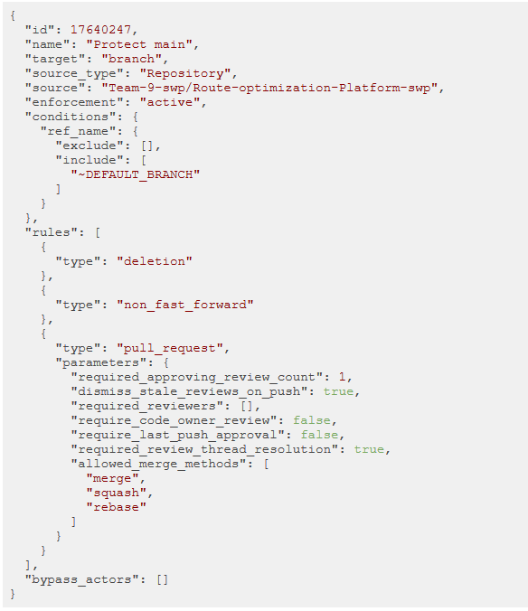
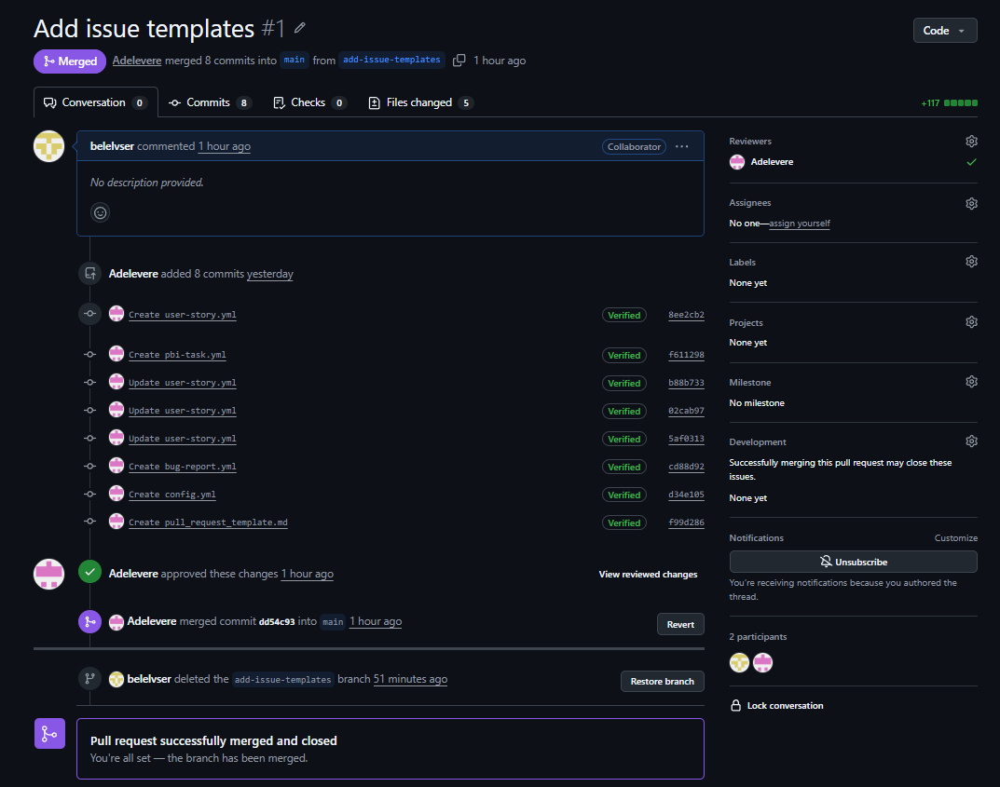
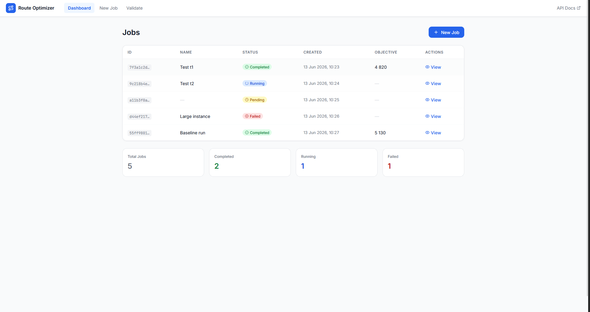
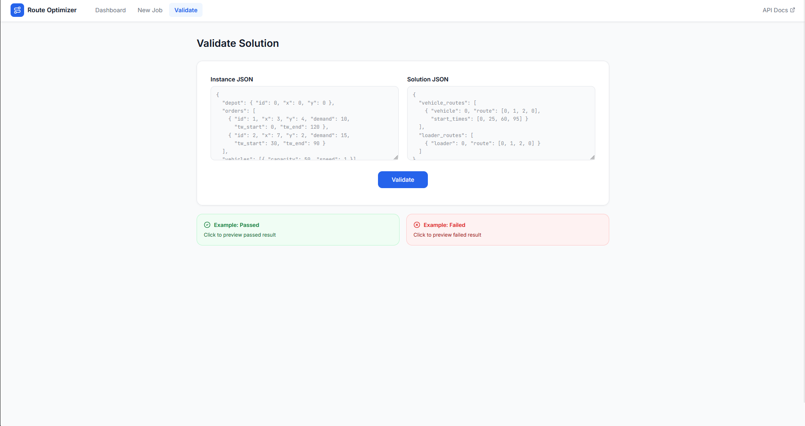

# Week 2 Report — Route Optimization Platform

## 1. Project Overview

**Route Optimization Platform** is a logistics optimization system that generates vehicle and loader routes while considering time windows, vehicle capacity, loader requirements, and other hard constraints.

1. [Project repository](https://github.com/Team-9-swp/Route-optimization-Platform-swp)
2. [MIT License](../../LICENSE)

## 2. User Stories

1. [Week 2 User Stories](./user-stories.md)

## 3. Selected Interface and Prototype

The selected primary interface for the product is a **web user interface** (React + TypeScript SPA) that communicates with the solver over a REST API. The API itself is also an externally usable interface for technical users and integrations.

Selected artifacts:

1. [Web Interface Documentation](../../docs/interface.md)
2. **[Interactive Figma prototype](https://carry-race-78764713.figma.site/)**
3. [OpenAPI Specification](../../api/openapi.yaml)
4. [Postman Collection](../../api/postman_collection.json)
5. **Runnable artifact:** Docker Compose (`docker compose up --build`) from the repository root.
6. **Video demonstration:** included in the MVP v0 report.

The web interface allows users to:

1. upload or paste a problem instance JSON;
2. set a random seed and an optional job name;
3. run the solver asynchronously;
4. view job status, objective value, and validation result;
5. visualize vehicle and loader routes on an interactive map;
6. browse the list of recent jobs;
7. validate an arbitrary instance-solution pair.

## 4. MVP v0

1. [MVP v0 Report](./mvp-v0-report.md)
2. **Runnable artifact:** `docker compose up --build` from the repository root.
3. **Hosted instance:** `http://10.93.26.188:8000` (accessible from the university network).
4. **Run instructions:** provided in the [MVP v0 Report](./mvp-v0-report.md).
5. **Public MVP v0 video:** [MVP v0 smoke-check demonstration](https://drive.google.com/file/d/1L0qfgObksK1pZG03NED1RLrKNeGpqQqS/view?usp=sharing)

MVP v0 provides the runnable technical foundation of the product. It exposes the existing solver as an asynchronous FastAPI service: the user submits a JSON instance, the service runs the solver in the background, and the user polls for the completed result containing vehicle and loader routes.
## 5. Pull Request Workflow

1. [Pull Request Template](../../.github/pull_request_template.md)
2. [PR #1 — Week 2 report and documentation](https://github.com/Team-9-swp/Route-optimization-Platform-swp/pull/1)
3. [PR #2 — Issue and Pull Request templates](https://github.com/Team-9-swp/Route-optimization-Platform-swp/pull/2)
4. **Reviewed and approved PR:** pending — add a link after another team member submits an `Approve` review.
5. **Merged PR:** pending — update after the reviewed PR is merged into `main`.

The required review must be completed by another team member. A self-review does not count.

## 6. Lychee Link Checking

1. [Lychee Workflow Configuration](../../.github/workflows/lychee.yml)
2. **Latest successful run on the protected `main` branch:** pending — add the GitHub Actions run link after the workflow is configured.

Lychee must check Markdown links:

1. when a Pull Request is created or updated;
2. when changes are pushed or merged into `main`.

## 7. Excluded Lychee Links

No links are currently excluded from Lychee checks.

If exclusions are added later, each excluded link must be listed here together with:

1. the reason for exclusion;
2. confirmation that it was manually opened in a browser;
3. the manual verification date.

**Manual verification date:** pending — add date before submission.
## 8. Screenshots

All screenshots must be stored in `reports/week2/images/` in PNG format.

### 8.1 Protected Default Branch

### 8.2 Reviewed Pull Request

### 8.3 Selected Web Interface

The interactive prototype is published on Figma:

**[Figma prototype — Route Optimizer](https://carry-race-78764713.figma.site/)**

Screenshots of the web interface:

#### Dashboard

#### New Job

#### Route Preview

#### Validate

### 8.4 MVP v0 Runnable Artifact

The MVP v0 runnable artifact is the FastAPI service exposed by the Docker Compose setup and the hosted university VM. The screenshots above show the web interface consuming this service.

## 9. Coverage

### 9.1 Interface Coverage

The selected web interface and REST API represent the following user stories:

1. [US-01: Vehicle route and schedule](./user-stories.md#us-01-vehicle-route-and-schedule)
   The generated output contains the route and visit schedule for each vehicle.

2. [US-02: Loader route](./user-stories.md#us-02-loader-route)
   The generated output contains loader assignments and routes.

3. [US-03: Hard constraint validation](./user-stories.md#us-03-hard-constraint-validation)
   The solution can be checked using the validation script and, in the web UI, through the dedicated Validate page.

4. [US-04: Docker execution](./user-stories.md#us-04-docker-execution)
   The solver can be started with Docker Compose; the web frontend is planned for MVP v1.

5. [US-05: Algorithm time limit](./user-stories.md#us-05-algorithm-time-limit)
   The API is intended to accept a configurable execution time limit.

6. [US-06: Reproducible random seed](./user-stories.md#us-06-reproducible-random-seed)
   The API accepts a `seed` query parameter for reproducible runs.

7. [US-07: Objective function value](./user-stories.md#us-07-objective-function-value)
   The result includes or allows calculation of the objective function value.

8. [US-08: Planned routes overview](./user-stories.md#us-08-planned-routes-overview)
   The web UI shows all planned vehicle and loader routes in a table and on a map.

9. [US-10: Route visualization](./user-stories.md#us-10-route-visualization)
   The prototype demonstrates how vehicle and loader routes can be visualized on an interactive map in the Job Detail view.

The interface pages, workflows, input and output formats, success examples, and error cases are documented in [docs/interface.md](../../docs/interface.md). The REST API contract is available in [api/openapi.yaml](../../api/openapi.yaml) and [api/postman_collection.json](../../api/postman_collection.json).

### 9.2 MVP v0 Coverage

The MVP v0 foundation is described in the [MVP v0 Report](./mvp-v0-report.md).

MVP v0 currently provides a foundation for:

1. [US-01: Vehicle route and schedule](./user-stories.md#us-01-vehicle-route-and-schedule)
2. [US-02: Loader route](./user-stories.md#us-02-loader-route)
3. [US-03: Hard constraint validation](./user-stories.md#us-03-hard-constraint-validation)
4. [US-04: Docker execution](./user-stories.md#us-04-docker-execution)
5. [US-10: Route visualization](./user-stories.md#us-10-route-visualization) — the data and API foundation that a future visualization layer can consume.

The MVP v0 report also contains a repeatable smoke-check scenario covering:

1. cloning the repository;
2. building and starting the Docker Compose services;
3. submitting a sample instance via `POST /solve`;
4. polling `GET /jobs/{job_id}` until the job is terminal;
5. confirming that the result contains valid `vehicles` and `loaders` arrays;
6. opening Swagger UI at `http://localhost:8000/docs`.

MVP v0 is a product foundation and does not need to fully implement every related user story.

## 10. Customer Meeting Transcript and Notes

1. [Sanitized Customer Meeting Transcript](./customer-meeting-transcript.md)
2. **Publication permission:** granted — the sanitized transcript may be published in the public repository.

## 11. Customer Meeting Summary

1. [Customer Meeting Summary](./customer-meeting-summary.md)

The summary contains the main customer feedback, approved decisions, interface discussion, technical recommendations, and agreed next steps.

## 12. Week 2 Analysis

1. [Week 2 Analysis](./analysis.md)

The analysis describes the main learning points, validated assumptions, unresolved questions, and planned response for MVP v1.

## 13. AI and LLM Usage

1. [LLM and AI Usage Report](./llm-report.md)

The report describes the use of Whisper for meeting transcription and ChatGPT for translation, transcript correction, and report structuring.

## 14. Items to Complete Before Submission

1. ✅ Create and complete `docs/interface.md`.
2. ✅ Create and configure `.github/workflows/lychee.yml`.
3. ⬜ Run Lychee successfully on the protected `main` branch (blocked until the workflow is merged into `main`).
4. ⬜ Obtain an `Approve` review from another team member.
5. ⬜ Merge the reviewed PR into `main`.
6. ✅ Add the runnable MVP v0 artifact (Docker Compose).
7. ✅ Record and publish the MVP v0 video shorter than two minutes.
8. ✅ Add or update all required PNG screenshots, including the new web interface mockups.
9. ✅ Manually check all excluded and external links.
10. ✅ Confirm transcript publication or private sharing permission.
11. ✅ Verify that every link works before submission (re-check after PR merge and video link insertion).

