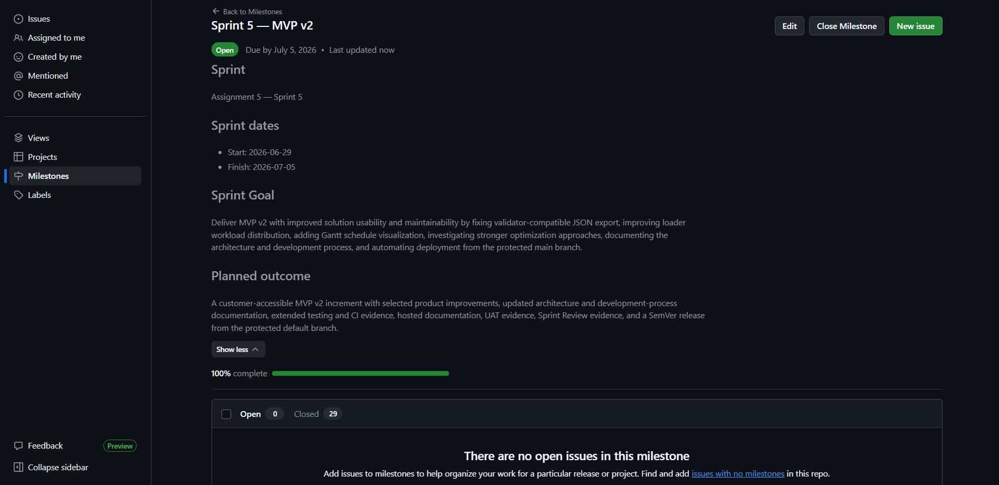
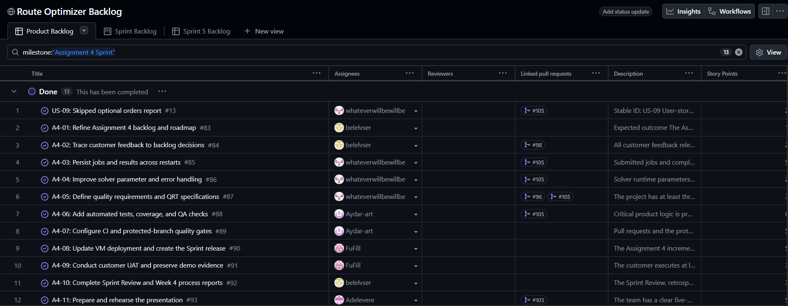
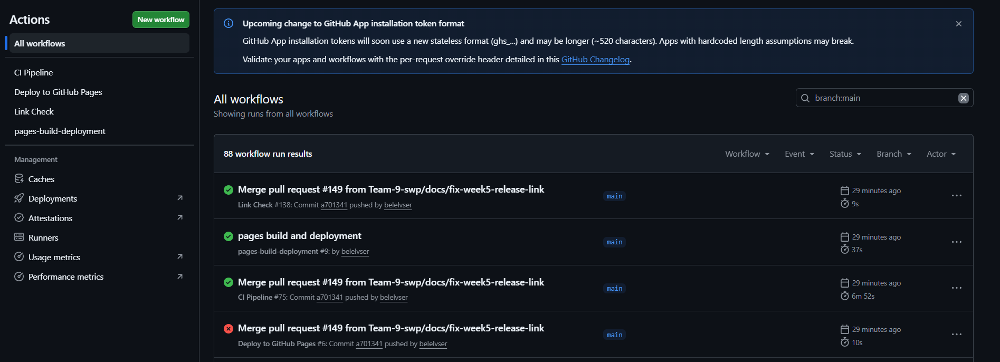
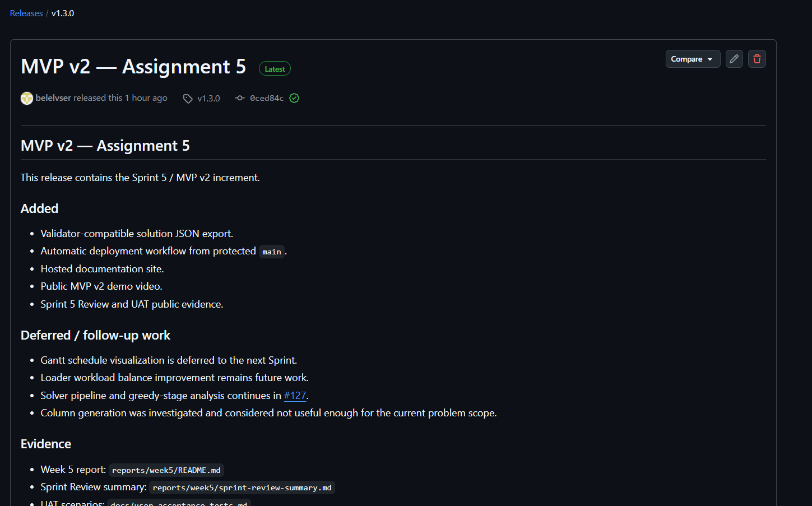
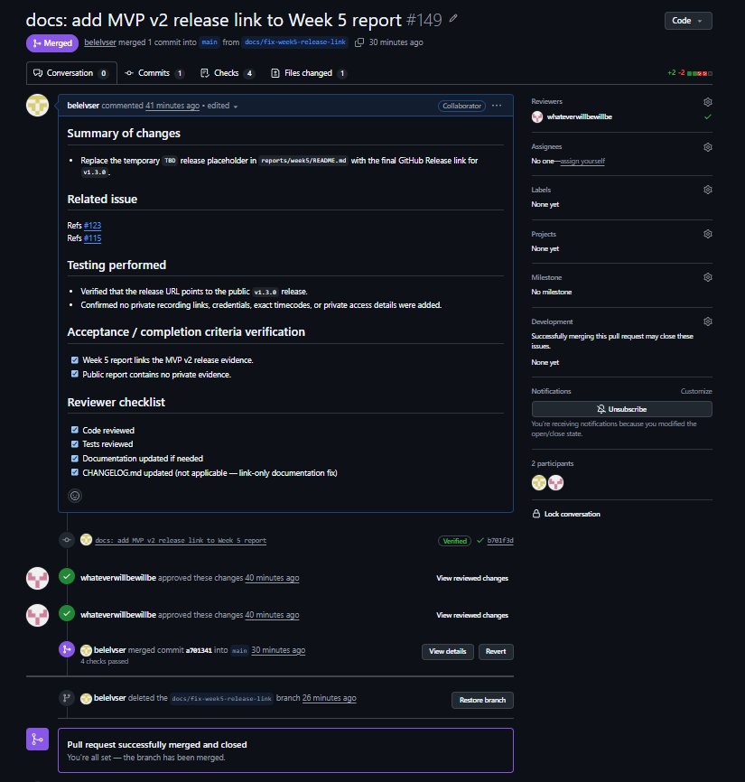
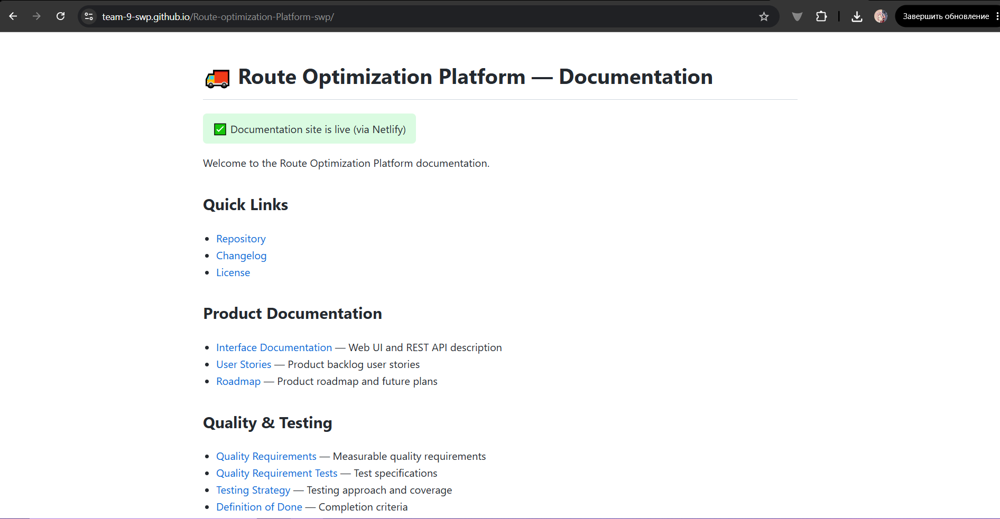
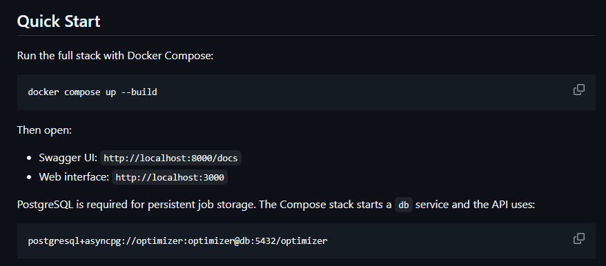

# Week 5 Report — MVP v2

## Project Overview

**Project:** Route Optimization Platform  
**Team:** Team 9  
**Short description:** A logistics optimization platform for generating, validating, and reviewing vehicle and loader routes for the BIA CVRPTW problem variant.

## Assignment 5 Evidence Index

| Requirement area | Public evidence |
|---|---|
| Product Backlog board/view | [Product Backlog](https://github.com/orgs/Team-9-swp/projects/1/views/1) |
| Sprint Backlog board/view | [Team GitHub Project](https://github.com/orgs/Team-9-swp/projects/1) |
| Sprint 5 milestone | [Sprint 5 — MVP v2](https://github.com/Team-9-swp/Route-optimization-Platform-swp/milestone/7) |
| Sprint 5 planning | [Roadmap](../../docs/roadmap.md), [Sprint 5 planning artifact](../../docs/assignment5-sprint5-planning.md) |
| Customer feedback response | [Customer Feedback Response](#customer-feedback-response) |
| Development process | [Development process](../../docs/development-process.md) |
| Architecture views | [Architecture documentation](../../docs/architecture/README.md) |
| ADRs | [ADR index](../../docs/architecture/adr/README.md) |
| Testing / QA / DoD | [Testing strategy](../../docs/testing.md), [Definition of Done](../../docs/definition-of-done.md) |
| Quality requirements | [Quality requirements](../../docs/quality-requirements.md) |
| Quality requirement tests | [Quality requirement tests](../../docs/quality-requirement-tests.md) |
| UAT | [User Acceptance Tests](../../docs/user-acceptance-tests.md) |
| Sprint Review summary | [Sprint 5 Review Summary](sprint-review-summary.md) |
| Sprint Review transcript | [Sanitized Sprint Review Transcript](sprint-review-transcript.md) |
| Retrospective | [Retrospective](retrospective.md) |
| Reflection | [Reflection](reflection.md) |
| LLM usage | [LLM usage report](llm-report.md) |
| Hosted documentation | [Hosted documentation](https://team-9-swp.github.io/Route-optimization-Platform-swp/) |
| Demo video | [MVP v2 demo](https://disk.yandex.ru/i/CXjgSum-9lTAjg) |
| SemVer release | [v1.3.0](https://github.com/Team-9-swp/Route-optimization-Platform-swp/releases/tag/v1.3.0) |
| Changelog | [CHANGELOG.md](../../CHANGELOG.md) |

## Sprint Goal, Dates, and Scope

**Sprint:** Sprint 5 — MVP v2  
**Sprint dates:** 2026-06-29 to 2026-07-05  
**Total Sprint size:** 79 Story Points  

**Sprint Goal:** Deliver MVP v2 with improved usability and maintainability by addressing selected customer feedback, improving validation/export support, documenting architecture and development process, preparing release evidence, conducting UAT, and reviewing the increment with the customer.

**Scope summary:** Sprint 5 focused on MVP v2 reporting, customer feedback response, release/deployment evidence, UAT, Sprint Review, hosted documentation, architecture documentation, ADRs, testing/QA/DoD updates, and documentation of deferred product work.

## Delivered MVP v2 Changes

- Validator-compatible solution JSON export.
- Automatic deployment workflow from protected `main`.
- Hosted documentation site.
- Sprint 5 Review summary.
- Sanitized Sprint Review transcript.
- Public MVP v2 demo video.
- Updated Week 5 public report.
- Updated development process documentation.
- Updated architecture documentation and ADRs.
- Updated testing, QA, and Definition of Done documentation.
- Week 5 reflection, retrospective, and LLM usage report.

## Product Access and Run Instructions

Public product repository:

- [Route Optimization Platform repository](https://github.com/Team-9-swp/Route-optimization-Platform-swp)

Current public run/access instructions:

- [Root README run instructions](../../README.md)
- [Deployment documentation](../../docs/deployment.md)
- [Hosted documentation](https://team-9-swp.github.io/Route-optimization-Platform-swp/)

Private access details, exact deployment access instructions, credentials, recording links, and exact timecodes are submitted through Moodle only.
| Release | GitHub Release: [v1.3.0](https://github.com/Team-9-swp/Route-optimization-Platform-swp/releases/tag/v1.3.0) |

## Customer Feedback Response

Public sources reviewed:

- [Week 2 customer meeting summary](../week2/customer-meeting-summary.md)
- [Week 2 sanitized customer meeting transcript](../week2/customer-meeting-transcript.md)
- [Week 3 customer review summary](../week3/customer-review-summary.md)
- [Week 3 sanitized customer review transcript](../week3/customer-review-transcript.md)
- [Week 4 customer feedback response](../week4/customer-feedback-response.md)
- [Week 4 customer review notes](../week4/customer-review-notes.md)
- [Week 4 customer review summary](../week4/customer-review-summary.md)
- [User acceptance tests](../../docs/user-acceptance-tests.md)
- [Roadmap](../../docs/roadmap.md)

Private recording links, customer identity, credentials, exact timecodes, and private access details are intentionally excluded from this public report.

| Feedback point | Resulting PBI or issue | Status | Response |
|---|---|---|---|
| The customer requested route visualization suitable for benchmark coordinates rather than a real geographic map. | [#14](https://github.com/Team-9-swp/Route-optimization-Platform-swp/issues/14) | Done in an earlier Sprint | Coordinate-plane route visualization was completed earlier and remains part of the maintained product. |
| The customer requested visibility into optional orders that were not served. | [#13](https://github.com/Team-9-swp/Route-optimization-Platform-swp/issues/13) | Done in an earlier Sprint | Skipped optional orders are reported in solver/API results; Sprint 5 keeps this as maintained product behavior. |
| The customer requested calculation history and confirmed that persistent storage is appropriate for a dynamic interface. | [#85](https://github.com/Team-9-swp/Route-optimization-Platform-swp/issues/85) | Done in an earlier Sprint | Jobs, results, and validation metadata were moved to PostgreSQL-backed persistence. Retention and cleanup policy work remains outside this Sprint 5 task. |
| The customer requested measurement of solver execution time. | [#87](https://github.com/Team-9-swp/Route-optimization-Platform-swp/issues/87), [#88](https://github.com/Team-9-swp/Route-optimization-Platform-swp/issues/88) | Done in an earlier Sprint | Assignment 4 quality requirements and QRTs include solver time behaviour evidence. |
| The customer requested comparison with the baseline and investigation of whether the greedy stage weakens objective values. | [#97](https://github.com/Team-9-swp/Route-optimization-Platform-swp/issues/97), [#127](https://github.com/Team-9-swp/Route-optimization-Platform-swp/issues/127) | Continued after Sprint 5 | Sprint 5 confirmed the direction, but the solver pipeline and greedy-stage investigation require more time and continue next week. |
| The customer recommended considering a more joint approach to vehicle routes, loader assignments, and optional-order selection. | [#23](https://github.com/Team-9-swp/Route-optimization-Platform-swp/issues/23), [#127](https://github.com/Team-9-swp/Route-optimization-Platform-swp/issues/127) | Continued after Sprint 5 | Closed issue #23 is historical context. Sprint 5 continues the investigation in #127. |
| The customer needed product access outside the university network or another explicitly agreed remote access method. | [#90](https://github.com/Team-9-swp/Route-optimization-Platform-swp/issues/90), [#115](https://github.com/Team-9-swp/Route-optimization-Platform-swp/issues/115) | Addressed through release/access evidence | Public release, hosted documentation, and private Moodle access instructions are used as the Sprint 5 access evidence. |
| The customer described balanced driver/loader workload as a possible later-stage business requirement. | [#124](https://github.com/Team-9-swp/Route-optimization-Platform-swp/issues/124) | Deferred | Loader workload balance is kept as future work. |
| The customer discussed Gantt-style schedules as a way to show vehicle/loader activity and idle time. | [#125](https://github.com/Team-9-swp/Route-optimization-Platform-swp/issues/125) | Deferred | Gantt schedule visualization is moved to the next Sprint. |
| The customer recommended reviewing column generation as a potentially stronger optimization approach. | [#128](https://github.com/Team-9-swp/Route-optimization-Platform-swp/issues/128) | Investigated / deferred | Column generation was investigated and considered not useful enough for the current task scope. |
| The customer suggested comparing repeated runs or reproducibility beyond a single fixed benchmark. | [#127](https://github.com/Team-9-swp/Route-optimization-Platform-swp/issues/127) | Continued after Sprint 5 | Same-seed reproducibility and solver pipeline analysis require more time and continue next week. |

## Feedback Not Addressed in Sprint 5

| Feedback / item | Reason |
|---|---|
| Gantt schedule visualization | Deferred to the next Sprint because Sprint 5 time was needed for release, documentation, UAT, Sprint Review, and higher-priority evidence. |
| Loader workload balance | Kept as future work because the team needs a clear workload-balance metric and additional solver validation before claiming a product change. |
| Solver pipeline and greedy-stage impact | Continued next week because the investigation required more benchmark time and algorithm analysis. |
| Column generation | Investigated, but not adopted because it was not useful enough for the current problem scope and implementation time. |
| Permanent external product access | Private access details and agreed access evidence are submitted through Moodle only; public repository excludes private access details. |

## Architecture Summary

The MVP v2 architecture uses a React frontend, FastAPI backend, PostgreSQL persistence, solver and validator components, Docker Compose packaging, and GitHub Actions workflows. The architecture separates user-facing workflows, API orchestration, optimization logic, validation, persistence, and deployment evidence.

This supports the current product by keeping route generation, validation, job history, export, documentation, and release/deployment evidence traceable across issues, PRs, tests, and reports.

## Architecture and Quality Traceability

Quality requirements are linked to architecture decisions through:

- solver functional correctness and validator-compatible outputs;
- time behaviour and benchmark-aware solver execution;
- recoverability through PostgreSQL-backed persistence;
- safe error handling and public-response confidentiality;
- deployment reliability through protected-main CI/CD and release evidence.

Relevant architecture and decision records:

- [Architecture documentation](../../docs/architecture/README.md)
- [ADR index](../../docs/architecture/adr/README.md)
- [Quality requirements](../../docs/quality-requirements.md)
- [Quality requirement tests](../../docs/quality-requirement-tests.md)

## Architecture View Artifacts

- [Static architecture view](../../docs/architecture/README.md)
- [Dynamic workflow view](../../docs/architecture/README.md)
- [Deployment view](../../docs/architecture/README.md)
- [ADR directory / index](../../docs/architecture/adr/README.md)

## Testing and CI Status

Public testing and quality evidence:

- [Testing strategy](../../docs/testing.md)
- [Definition of Done](../../docs/definition-of-done.md)
- [Quality requirements](../../docs/quality-requirements.md)
- [Quality requirement tests](../../docs/quality-requirement-tests.md)
- [CI pipeline](https://github.com/Team-9-swp/Route-optimization-Platform-swp/actions/workflows/ci.yml)
- [Latest protected-main CI runs](https://github.com/Team-9-swp/Route-optimization-Platform-swp/actions?query=branch%3Amain)

The delivered increment keeps backend tests, frontend typecheck/build, quality requirement tests, documentation checks, and release evidence as public quality gates. Private access and customer recording evidence are submitted through Moodle only.

## MVP v2 Release and Deployment

MVP v2 is released as `v1.3.0`.

Public release evidence:

- GitHub Release: [v1.3.0](https://github.com/Team-9-swp/Route-optimization-Platform-swp/releases/tag/v1.3.0)
- Changelog: [CHANGELOG.md](../../CHANGELOG.md)
- Hosted documentation: https://team-9-swp.github.io/Route-optimization-Platform-swp/
- Demo video: https://disk.yandex.ru/i/CXjgSum-9lTAjg

Private access details, exact deployment access instructions, recording links, and exact timecodes are submitted through Moodle only.

## Demo

Public sanitized MVP v2 demo video:

- [MVP v2 demo](https://disk.yandex.ru/i/CXjgSum-9lTAjg)

## UAT Results Summary

The Sprint Review and UAT were conducted in one combined customer session.

Private recording details:

- Recording link: submitted through Moodle only.
- UAT starts at 20:40 in the private recording.
- Exact timecodes and customer-identifying details are not committed publicly.

Public sanitized UAT evidence:

- [User Acceptance Tests](../../docs/user-acceptance-tests.md)
- [Sprint 5 Review Summary](sprint-review-summary.md)

UAT result summary:

| Scenario / area | Public result | Notes |
|---|---|---|
| Create a new optimized route with different seed values | Partially passed / needs follow-up | Different seed values produced different results, but repeated runs with the same seed require further investigation. |
| Inspect vehicle and loader route information | Partially passed / needs follow-up | Vehicle route information was visible; loader route semantics need clarification/fix. |
| Review validation feedback | Passed | Customer confirmed that immediate validator output is useful. |

## Sprint Review

- [Sprint 5 Review Summary](sprint-review-summary.md)
- [Sanitized Sprint Review Transcript](sprint-review-transcript.md)

The Sprint Review was conducted as a combined Sprint Review and UAT session. The public repository contains sanitized English evidence only. Private recording links, exact timecodes, recording permission evidence, customer identity, credentials, and private access details are submitted through Moodle only.

## Hosted Documentation

📖 [View the Hosted Documentation](https://team-9-swp.github.io/Route-optimization-Platform-swp/)

## Deferred and Follow-up Work

| Item | Issue | Sprint 5 decision |
|---|---|---|
| Gantt schedule visualization | [#125](https://github.com/Team-9-swp/Route-optimization-Platform-swp/issues/125) | Deferred to the next Sprint. |
| Loader workload balance | [#124](https://github.com/Team-9-swp/Route-optimization-Platform-swp/issues/124) | Kept as future work. |
| Solver pipeline and greedy-stage impact | [#127](https://github.com/Team-9-swp/Route-optimization-Platform-swp/issues/127) | Continued next week because more investigation time is required. |
| Column generation | [#128](https://github.com/Team-9-swp/Route-optimization-Platform-swp/issues/128) | Investigated and considered not useful enough for the current problem scope. |

## Current Product Status

MVP v2 is released as `v1.3.0`. The product has public release evidence, hosted documentation, a public sanitized demo video, Sprint Review evidence, UAT evidence, testing/QA documentation, architecture documentation, ADRs, and updated process documentation.

Some product improvements remain active follow-up work: Gantt visualization, loader workload balance, and deeper solver pipeline analysis.

## Next Steps

- Continue solver pipeline and greedy-stage impact investigation in [#127](https://github.com/Team-9-swp/Route-optimization-Platform-swp/issues/127).
- Move Gantt schedule visualization to the next Sprint under [#125](https://github.com/Team-9-swp/Route-optimization-Platform-swp/issues/125).
- Keep loader workload balance as future work under [#124](https://github.com/Team-9-swp/Route-optimization-Platform-swp/issues/124).
- Keep column generation as deferred research under [#128](https://github.com/Team-9-swp/Route-optimization-Platform-swp/issues/128).
- Continue improving stable customer access and deployment evidence.

## Contribution Traceability

| Team member | Assignment 5 responsibility | Issues / evidence | Technical / process contribution |
|---|---|---|---|
| Elvina Belorusova | Parts 1, 2, 9, Week 5 report / Moodle report | #109, #110, #117, #123; PR #131, #132, #147, #148, #149 | Sprint planning, customer feedback traceability, Sprint Review evidence, Week 5 reporting, Moodle report |
| Adelia | Parts 7, 10, 11, 12, 13, 14 | #115, #118, #119, #120, #121, #122; PR #144, #145 | Release support, retrospective, hosted documentation, reflection, demo video, LLM report |
| Matvey | Part 6 | #114 | Testing, QA, Definition of Done, quality evidence |
| Aidar | Part 8 | #116 | UAT scenarios and customer-facing validation |
| Valera | Parts 3, 4, 5 | #111, #112, #113 | Development process, architecture documentation, ADRs, configuration/deployment documentation |

## Screenshots

Screenshots are stored under `reports/week5/images/`.

### Sprint milestone

### Board or project workflow view

### Latest protected-default-branch CI run

### SemVer release

### Example reviewed issue-linked PR

### Hosted documentation site

### Product access artifact

| Team member | Assignment 5 responsibility | Technical / process contribution |
|---|---|---|
| Elvina Belorusova | Parts 1, 2, 9, Week 5 report / Moodle report | Sprint planning, customer feedback traceability, Sprint Review evidence, final reporting |
| Adelia | Parts 7, 10, 11, 12, 13, 14 | Release support, retrospective, hosted docs, reflection, demo video, LLM report |
| Matvey | Part 6 | Testing, QA, Definition of Done |
| Aidar | Part 8 | UAT scenarios and customer-facing validation |
| Valera | Parts 3, 4, 5 | Development process, architecture documentation, ADRs |
