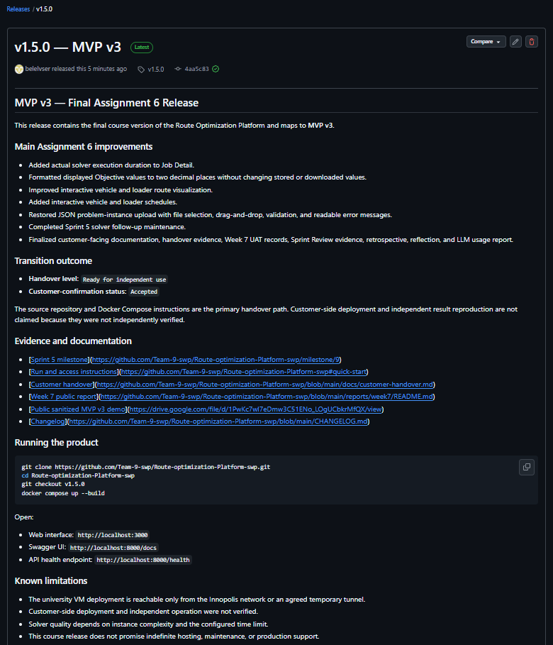
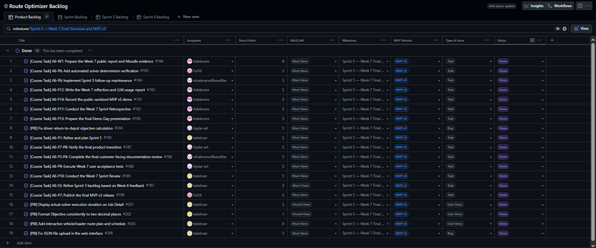
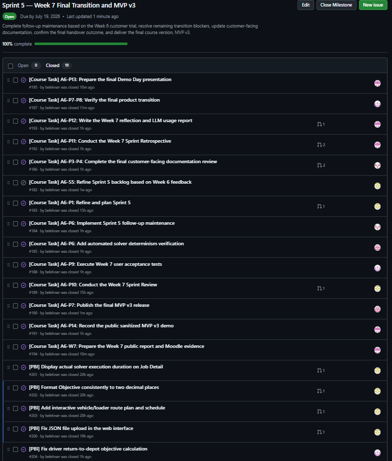
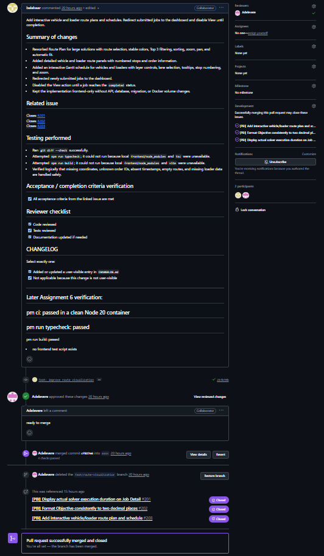
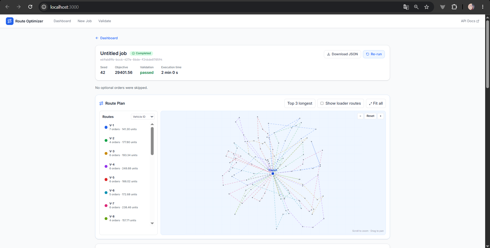
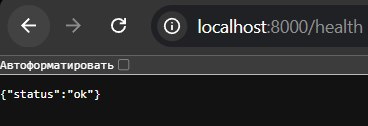

# Assignment 6 — Week 7 Public Submission Index

**Project:** Route Optimization Platform

**Team:** Team-9-swp

**Product state:** MVP v3 prepared for final course delivery

## Week 6 reference

The complete predecessor evidence is the [Assignment 6 Week 6 public report](../week6/README.md), including the `v1.4.0` trial release, UAT, Sprint Review, retrospective, reflection, and LLM report.

## Sprint 5 planning

- **Product Backlog board / GitHub Project:** [Route Optimizer Backlog](https://github.com/orgs/Team-9-swp/projects/1)
- **Sprint 5 Backlog:** [Sprint 5 milestone issues](https://github.com/Team-9-swp/Route-optimization-Platform-swp/milestone/9)
- **Milestone:** [Sprint 5 — Week 7 Final Transition and MVP v3](https://github.com/Team-9-swp/Route-optimization-Platform-swp/milestone/9)
- **Sprint Goal:** Complete Week 6 follow-up maintenance, improve the final user-facing workflow, document the actual transition state, and prepare a verified final course increment for MVP v3.
- **Sprint dates:** `2026-07-13 — 2026-07-19`
- **Canonical Sprint size:** `73 Story Points`, documented in [#183](https://github.com/Team-9-swp/Route-optimization-Platform-swp/issues/183)

The scope combined final solver maintenance, frontend usability and visualization improvements, documentation/UAT/transition evidence, a sanitized demo, and Demo Day preparation. Duplicate and overlapping coordination items were not double-counted; see the [roadmap](../../docs/roadmap.md).

## Week 7 changes

| Delivered work | Evidence |
|---|---|
| Actual solver execution duration on Job Detail | [#201](https://github.com/Team-9-swp/Route-optimization-Platform-swp/issues/201), [PR #205](https://github.com/Team-9-swp/Route-optimization-Platform-swp/pull/205) |
| Objective display formatted to two decimal places | [#202](https://github.com/Team-9-swp/Route-optimization-Platform-swp/issues/202), [PR #205](https://github.com/Team-9-swp/Route-optimization-Platform-swp/pull/205) |
| Improved interactive vehicle/loader route visualization and schedules | [#203](https://github.com/Team-9-swp/Route-optimization-Platform-swp/issues/203), [PR #205](https://github.com/Team-9-swp/Route-optimization-Platform-swp/pull/205) |
| Restored JSON problem-instance upload | [#206](https://github.com/Team-9-swp/Route-optimization-Platform-swp/issues/206), [PR #207](https://github.com/Team-9-swp/Route-optimization-Platform-swp/pull/207) |
| Sprint 5 solver follow-up maintenance | [#184](https://github.com/Team-9-swp/Route-optimization-Platform-swp/issues/184), [#204](https://github.com/Team-9-swp/Route-optimization-Platform-swp/issues/204), [PR #200](https://github.com/Team-9-swp/Route-optimization-Platform-swp/pull/200) |
| Current handover, UAT, planning, and Sprint Review evidence | [PR #208](https://github.com/Team-9-swp/Route-optimization-Platform-swp/pull/208) |

The dedicated determinism-verification issue [#185](https://github.com/Team-9-swp/Route-optimization-Platform-swp/issues/185) is closed, but this report does not overstate test evidence: repository inspection did not identify a dedicated same-seed-twice regression test by name.

## Product access and documentation

| Resource | Link |
|---|---|
| Repository and run instructions | [Root README](../../README.md) |
| Contribution guide | [CONTRIBUTING.md](../../CONTRIBUTING.md) |
| Coding-agent guide | [AGENTS.md](../../AGENTS.md) |
| Customer transition package | [Customer handover](../../docs/customer-handover.md) |
| Hosted documentation | [Documentation site](https://team-9-swp.github.io/Route-optimization-Platform-swp/) |
| Deployment, recovery, and rollback | [Deployment guide](../../docs/deployment.md) |
| Test strategy | [Testing](../../docs/testing.md) |
| Quality requirements and QRTs | [Quality requirements](../../docs/quality-requirements.md), [QRT specifications](../../docs/quality-requirement-tests.md) |
| Architecture | [Architecture index](../../docs/architecture/README.md) |
| Development process | [Development process](../../docs/development-process.md) |
| Acceptance testing | [UAT record](../../docs/user-acceptance-tests.md) |

## Final transition outcome

- **Handover level:** `Ready for independent use`
- **Customer-confirmation status:** `Accepted`

The team provided the source repository, Compose/run and deployment guidance, customer-facing usage and troubleshooting documentation, known limitations, support boundaries, public evidence, and the prepared MVP v3 product state. The customer confirmed the documentation set, transition model, final corrections, reached handover scope, and Assignment 6 result.

A stronger level is not claimed because the public evidence does not show customer-side deployment, health-check execution, independent operation, or independent result reproduction. Real limitations remain: the hosted deployment is campus-network-only, solver quality depends on time limit and instance constraints, finished visualization was not customer-executed during the recorded review, and this course project does not promise long-term production operations.

## Customer-facing documentation review

The customer confirmed the sufficiency of the root README, handover record, deployment/run guidance, usage guidance, troubleshooting and support guidance, known limitations, and reached transition scope. Private confirmation evidence and customer-identifying details are excluded from this repository and belong only in the Moodle submission.

## Customer feedback response

| Feedback point | Resulting issue/PBI | Status | Response |
|---|---|---|---|
| Show actual calculation duration | [#201](https://github.com/Team-9-swp/Route-optimization-Platform-swp/issues/201) | Done | Merged in PR #205. |
| Avoid long Objective decimal tails | [#202](https://github.com/Team-9-swp/Route-optimization-Platform-swp/issues/202) | Done | Display-only two-decimal formatting merged in PR #205. |
| Improve vehicle/loader route and schedule inspection | [#203](https://github.com/Team-9-swp/Route-optimization-Platform-swp/issues/203) | Done, team-verified | Interactive views merged in PR #205; finished behavior was not customer-executed during the Sprint Review. |
| Restore JSON upload workflow | [#206](https://github.com/Team-9-swp/Route-optimization-Platform-swp/issues/206) | Done | Merged in PR #207 after the review meeting. |
| Clarify handover and support end | [#186](https://github.com/Team-9-swp/Route-optimization-Platform-swp/issues/186) | Done | Support boundary and final acceptance are documented in the handover. |
| Customer-side reproduction with comparable results | [#187](https://github.com/Team-9-swp/Route-optimization-Platform-swp/issues/187) | Not executed | Readiness and documentation are accepted, but independent customer operation is not claimed. |

Deferred or non-executed feedback is not presented as completed UAT. Customer-side reproduction remains outside the available public evidence; final SemVer packaging is recorded in [#190](https://github.com/Team-9-swp/Route-optimization-Platform-swp/issues/190).

## Week 7 UAT summary

The [Week 7 UAT record](../../docs/user-acceptance-tests.md#week-7-review-record) separates evidence categories:

- earlier stable scenarios remain **Passed** from recorded customer execution;
- the documentation set and reached handover scope are **Reviewed/Accepted**;
- merged frontend/product changes are **Team-verified** by repository checks;
- execution duration and Objective formatting were **Discussed** during the review;
- finished visualization was **Blocked** from customer execution during that meeting;
- customer-side deployment/reproduction was **Not executed**.

Final confirmation changes the documentation/handover status to `Accepted`; it does not relabel unexecuted product scenarios as customer-passed. Resulting work is tracked through [#186](https://github.com/Team-9-swp/Route-optimization-Platform-swp/issues/186), [#187](https://github.com/Team-9-swp/Route-optimization-Platform-swp/issues/187), and [#188](https://github.com/Team-9-swp/Route-optimization-Platform-swp/issues/188).

## Sprint Review evidence

- [Sanitized Sprint Review summary](sprint-review-summary.md)
- [Sanitized public transcript](sprint-review-transcript.md)

The public transcript is sanitized. The private recording, exact timecodes, customer identity, and private access details remain Moodle-only.

## Retrospective, reflection, and LLM report

- [Sprint 5 retrospective](retrospective.md)
- [Week 7 reflection](reflection.md)
- [Week 7 LLM usage report](llm-report.md)

## Public demo

[Public sanitized MVP v3 demo](https://drive.google.com/file/d/1PwKc7wl7eDmw3C51ENo_LOgUCbkrMfQX/view)

The link was verified without authentication as a Google Drive view/download for an MP4 file. It is the public sanitized product demonstration, not a private customer recording or rehearsal video.

## Release status

- **Final SemVer MVP v3 release:** [`v1.5.0`](https://github.com/Team-9-swp/Route-optimization-Platform-swp/releases/tag/v1.5.0), tracked in [#190](https://github.com/Team-9-swp/Route-optimization-Platform-swp/issues/190).
- **Changelog:** [`1.5.0` changes](../../CHANGELOG.md#150---2026-07-19).

## Demo Day preparation

Issue [#195](https://github.com/Team-9-swp/Route-optimization-Platform-swp/issues/195) records the presentation structure, short pre-recorded demo, speaking-part distribution, Q&A responsibilities, and rehearsal preparation. The final slide-deck state, private PDF, seven-minute version, and completed rehearsal are not verified in the public evidence and remain open in #195.

## Contribution traceability

| GitHub username | Public contribution evidence |
|---|---|
| `belelvser` | Sprint planning [#183](https://github.com/Team-9-swp/Route-optimization-Platform-swp/issues/183); frontend work in [PR #205](https://github.com/Team-9-swp/Route-optimization-Platform-swp/pull/205); JSON upload in [PR #207](https://github.com/Team-9-swp/Route-optimization-Platform-swp/pull/207); handover evidence in [PR #208](https://github.com/Team-9-swp/Route-optimization-Platform-swp/pull/208). |
| `FuFill` | Solver work reviewed/merged through [PR #200](https://github.com/Team-9-swp/Route-optimization-Platform-swp/pull/200); determinism task [#185](https://github.com/Team-9-swp/Route-optimization-Platform-swp/issues/185); review/merge of PR #208. |
| `Aydar-art` | Transition/UAT work [#187](https://github.com/Team-9-swp/Route-optimization-Platform-swp/issues/187), [#188](https://github.com/Team-9-swp/Route-optimization-Platform-swp/issues/188); Objective maintenance [#204](https://github.com/Team-9-swp/Route-optimization-Platform-swp/issues/204); review/merge of PR #200. |
| `Adelevere` | Public demo [#191](https://github.com/Team-9-swp/Route-optimization-Platform-swp/issues/191), retrospective [#192](https://github.com/Team-9-swp/Route-optimization-Platform-swp/issues/192), reflection/LLM report [#193](https://github.com/Team-9-swp/Route-optimization-Platform-swp/issues/193), Demo Day preparation [#195](https://github.com/Team-9-swp/Route-optimization-Platform-swp/issues/195), and review/merge of PRs #205/#207. |
| `whateverwillbewillbe` | Customer-facing documentation [#186](https://github.com/Team-9-swp/Route-optimization-Platform-swp/issues/186) and Week 7 documentation branch/PR [#199](https://github.com/Team-9-swp/Route-optimization-Platform-swp/pull/199). |

The table uses public GitHub usernames only. Private identity fields and university email addresses are excluded.

## Screenshot evidence

The following sanitized screenshots provide the public Week 7 visual evidence. They contain public GitHub metadata or local product URLs only; they do not demonstrate customer-side deployment or expose private access instructions.

### Published MVP v3 release

The release screenshot records the published [`v1.5.0 — MVP v3`](https://github.com/Team-9-swp/Route-optimization-Platform-swp/releases/tag/v1.5.0) GitHub Release and its public release notes.

### Sprint 5 board view

The board screenshot records the Project fields and issue status visible at capture time. It is planning/traceability evidence, not SemVer release evidence.

### Sprint 5 milestone

The milestone screenshot records the closed-item view visible at capture time. It is planning/traceability evidence; the separate [`v1.5.0` GitHub Release](https://github.com/Team-9-swp/Route-optimization-Platform-swp/releases/tag/v1.5.0) is the release evidence.

### Reviewed implementation PR

PR #205 shows an issue-linked implementation, checks, review by a different participant, and merge evidence for the route-visualization work.

### Local product access

The local product view shows a completed and validated job, execution duration, Objective presentation, and the interactive route plan. It does not claim customer-side operation.

### Local API health check

The health screenshot verifies the local `GET /health` response only. It is not evidence of customer-side or public production deployment.

## Final product status

The final Assignment 6 product state is published as [`v1.5.0`](https://github.com/Team-9-swp/Route-optimization-Platform-swp/releases/tag/v1.5.0), the customer documentation and reached handover scope are accepted, the public sanitized demo is available, and the public screenshot set is included above. Private Moodle/slides/rehearsal evidence stays outside the public repository.
